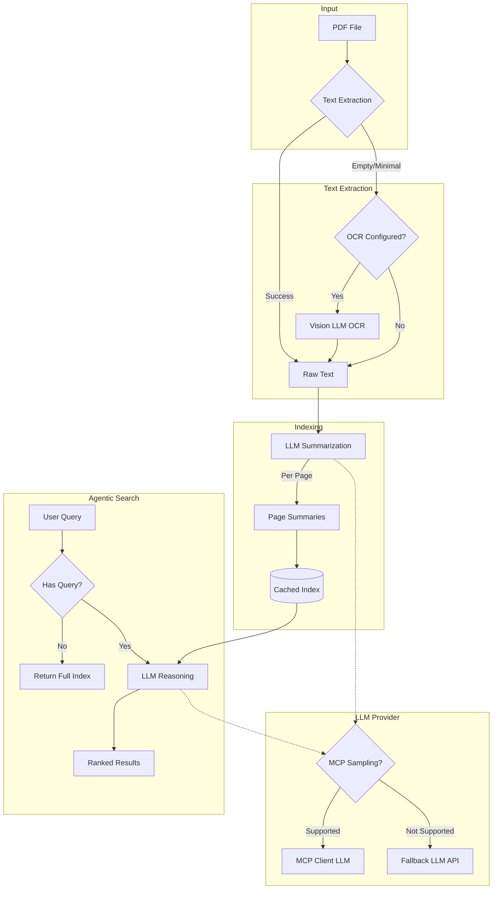

<div align="center">

# PageIndex Light MCP

[](https://python.org)
[](https://github.com/jlowin/fastmcp)
[](https://modelcontextprotocol.io)
[](LICENSE)

**Agentic PDF Search via MCP — Inspired by [PageIndex](https://github.com/VectifyAI/PageIndex)**

*Vectorless, reasoning-based document retrieval that thinks like a human*

</div>

---

## Overview

PageIndex Light MCP brings **agentic search** capabilities to your PDF documents through the Model Context Protocol. Instead of traditional vector similarity, it leverages LLM reasoning for intelligent, human-like document navigation.

Inspired by [VectifyAI/PageIndex](https://github.com/VectifyAI/PageIndex) and [pageindex-mcp](https://github.com/VectifyAI/pageindex-mcp).

## Features

- **Agentic Search** — LLM-powered semantic search through document structure
- **MCP Sampling** — Native MCP protocol sampling support
- **LLM Fallback** — Auto-fallback to OpenAI-compatible APIs for non-sampling clients
- **OCR Fallback** — Automatic OCR for scanned PDFs

## Tools

| Tool | Description |
|------|-------------|
| `get_index` | Get PDF index with semantic search support |
| `get_detail` | Retrieve detailed content of a specific page |

## How It Works



## Quick Start

### Claude Desktop / Claude Code

Add to your MCP config:

```json
{
  "mcpServers": {
    "pageindex": {
      "command": "uv",
      "args": ["run", "--directory", "/path/to/pageindex-light-mcp", "server.py"],
      "env": {
        "PAGEINDEX_LLM_BASE_URL": "https://api.openai.com/v1",
        "PAGEINDEX_LLM_API_KEY": "sk-xxx",
        "PAGEINDEX_LLM_MODEL": "gpt-4o-mini",
        "PAGEINDEX_OCR_BASE_URL": "https://api.openai.com/v1",
        "PAGEINDEX_OCR_API_KEY": "sk-xxx",
        "PAGEINDEX_OCR_MODEL": "gpt-4o-mini"
      }
    }
  }
}
```

### Environment Variables

Both configurations are **optional and independent**:

| Variable | Purpose | Required |
|----------|---------|----------|
| `PAGEINDEX_LLM_*` | Fallback for non-Sampling MCP clients | Optional |
| `PAGEINDEX_OCR_*` | Fallback for scanned PDFs (when text extraction fails) | Optional |

```bash
# LLM Config — Used when MCP client doesn't support Sampling
PAGEINDEX_LLM_BASE_URL=https://api.openai.com/v1
PAGEINDEX_LLM_API_KEY=sk-xxx
PAGEINDEX_LLM_MODEL=gpt-4o-mini

# OCR Config — Used when PDF text extraction returns empty/minimal content
PAGEINDEX_OCR_BASE_URL=https://api.openai.com/v1
PAGEINDEX_OCR_API_KEY=sk-xxx
PAGEINDEX_OCR_MODEL=gpt-4o-mini  # Any vision-capable model
```

## License

MIT
